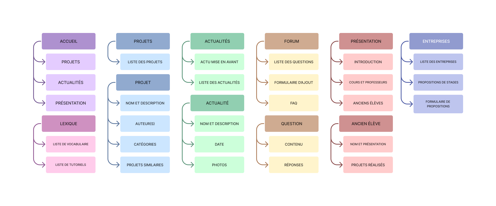

# cahier des charges

## 1. Présentation d’ensemble du projet
### présentation de l'entreprise :

[Bachelier en Techniques Infographiques - option Web](https://www.hepl.be/fr/techniques-infographiques/web)

Principaux concurrents :
  - [Design Web Transmedia](http://dwm.re/)
  - [Digital Campus](https://www.digital-campus.fr/vie-etudiante/actualites/ecole-web)
  - [O'clock](https://oclock.io/)

### objectifs :

L'objectif principal du site est d'augmenter les nombres d'étudiants inscrits à la section au moyen de 3 grandes sections :

1. Présenter les différents projets réalisés au fil des années et permettre aux anciens étudiants de partager leur expérience et leur métier, ainsi qu'expliquer en détail le programme des cours et présenter les différents professeurs afin que les futurs étudiants sachent à quoi s'attendre. Une section _Glossaire/Tutoriels_ permettrait aussi d'informer sur les normes de la qualité web.

2. Présenter le réseau professionnel de la section avec différentes entreprises et permettre à celles-ci de présenter leurs différents métiers mais aussi de mettre en avant leurs offres de stages via un formulaire.

3. Faciliter les échanges et l'information en proposant un forum (nécessite un compte) pour poser des questions et partager ses connaissances, ainsi qu'une mise en avant des différentes actualités de la section (participation à des évènements, journée porte ouverte,...). Pour les questions fréquentes, une FAQ peut aussi être mise en place.

### cible :

Le site s'adresse en priorité à de futurs étudiants _(tout juste sorti du secondaire ou étudiants cherchant à se réorienter, par exemple)_. C'est aussi un moyen pour des entreprises de mettre en avant leurs offres de stages et pour les anciens élèves de faire part de leur expérience.

### périmètre du projet :

Le site doit être disponible en Français, Anglais, Allemand et Néerlandais et adapté à tous les supports.

### description :

Différents documents et ressources sont mis à notre disposition en tant que base de contenu et d'inspiration :
- le [site du bachelier WEB de l'HEPL](https://www.hepl.be/fr/techniques-infographiques/web)
- le logo de l'HEPL
- le projet d'un ancien élève (Jimmy Letecheur)

---

## 2. Description fonctionnelle et technique
### arborescence :

### description fonctionnelle :

L'administration du site comprend différents rôles qui auront chacun des droits et fonctionnalités différentes :
- un utilisateur non connecté peut seulement se balader sur le site
- un utilisateur connecté peut poster et répondre aux questions sur le forum
- les ou les sous admnistrateurs peuvent ajouter un projet ou un partenaire (ancien élève, entreprise,...), publier et mettre en avant une actualité, mettre à jour la FAQ et le glossaire  
- le ou les admnistrateurs s'occupent de vérifier et publier les propositions de stages 

Chaque niveau de la hiérarchie hérite évidemment des fonctionnalités des niveaux inférieurs.

Le site comprend un moteur de recherche interne ainsi que l'option de s'inscrire à une newsletter.

### informations relatives aux contenus :

Le site propose différents types de contenus :
  - des articles avec possiblement des images et vidéos
  - des fiches informationnelles (projets, élèves, professeurs,...) contenant des images et potentiellement des vidéos

Certains contenus ont la possibilité d'être partagé sur des plateformes externes par les utilisateurs

### contraintes techniques :

Le site est construit à l'aide Laravel et un peu de Javascript en visant un niveau d'accessibilité minimum AA. Le site entier doit être responsive.

La gestion d'un compte est nécessaire au minimum pour pouvoir utiliser le forum.

Les offres de stages sont proposées via un formulaire puis "vérifiées" par un administrateur avant de pouvoir être affichées.

### mots clés :

- école de web/d'infographie
- école de web/d'infographie
- formation en web/infographie
- bachelier en web/infographie
- stages de web/d'infographie